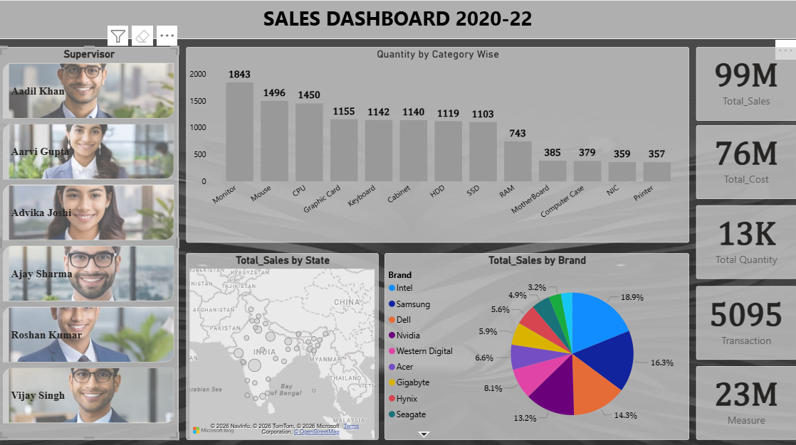
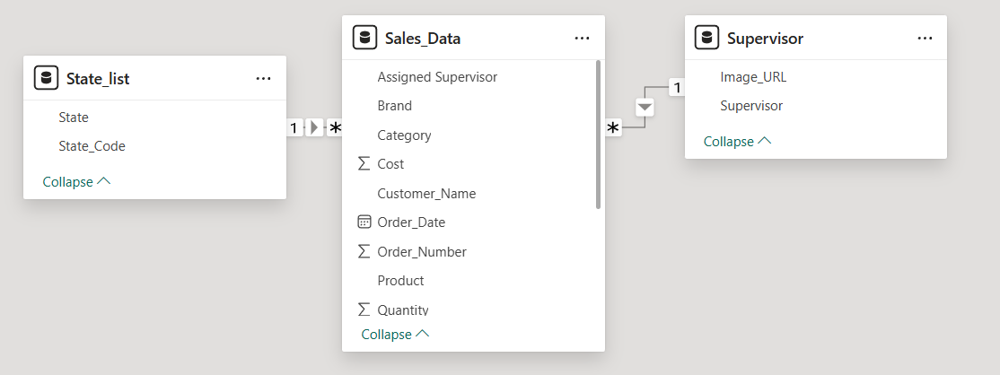
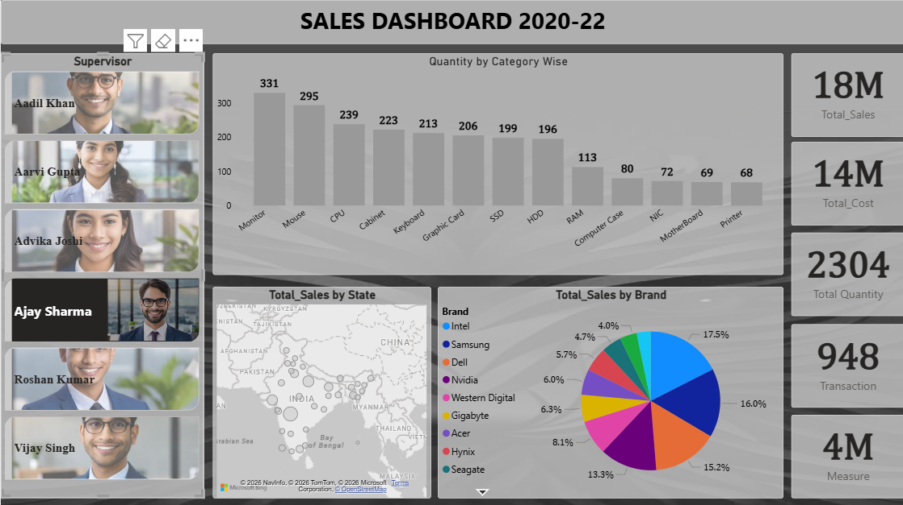

# 📊  Company Sales Dashboard | Power BI

## 📌 Overview

This Power BI project is designed to analyze and visualize sales data through an interactive and easy-to-understand dashboard. The primary goal of this project is to transform raw sales data into meaningful business insights that help track overall performance and identify growth opportunities. By using a combination of charts, KPI cards, and visual elements, the dashboard presents important metrics such as total sales, profit, quantity sold, and regional performance in a clear and organized manner.

The dashboard enables users to quickly identify sales trends, compare product categories, evaluate regional performance, and monitor monthly business growth. It demonstrates how Power BI can be used to convert complex datasets into informative reports that support better business decisions.

## ✨ Features

- Interactive KPI Cards displaying Total Sales, Profit, and Quantity
- Bar, Pie, Maps, and Charts
- Monthly Sales Trend Analysis
- Region-wise and Category-wise Sales Performance
- Product-wise Sales Comparison
- Clean and User-Friendly Dashboard Layout
- Attractive visual design using icons and images
- Using Uploaded photos as image demostration in Slicers

## 🛠️ Tools & Technologies

- Microsoft Power BI
- Power Query
- DAX (Data Analysis Expressions)
- Microsoft Excel

## 📊 Key Insights

- Analyzed overall sales and profit performance.
- Identified top-performing products and categories.
- Compared sales across different regions.
- Monitored monthly sales trends and business growth.
- Presented business insights through interactive visualizations.

## 📷 Dashboard Preview
### Original Preview

### Model Preview

### Filter Preview

## 📌 Conclusion

This project highlights my ability to perform data cleaning, data modeling, and dashboard development using Power BI. It demonstrates practical Business Intelligence skills by converting raw sales data into an informative dashboard that helps users understand performance, identify trends, and make data-driven decisions.